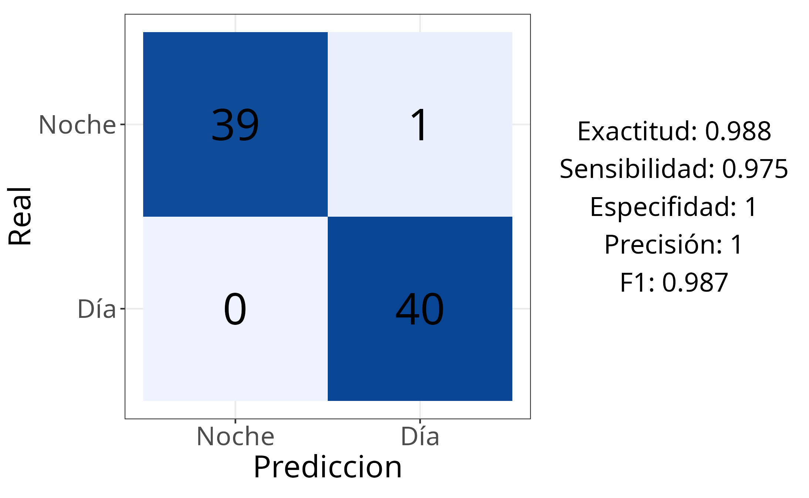
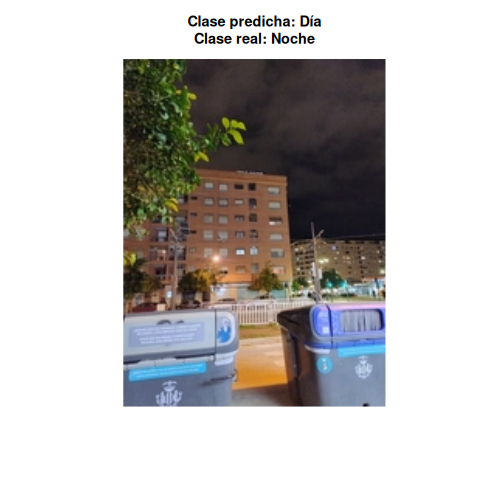
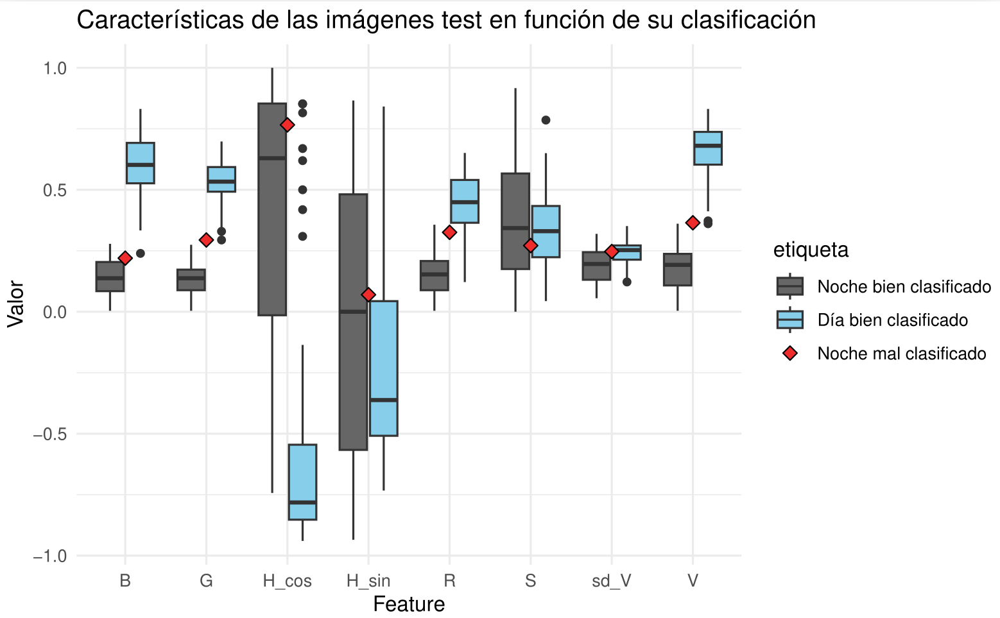

```{r setup, include=FALSE}
knitr::opts_chunk$set(echo = TRUE)
```

# Introducción al Problema

## Objetivo del Proyecto

El presente trabajo se enmarca dentro del ámbito del análisis digital de señales, aplicando técnicas de procesamiento de imágenes para la resolución de un problema de clasificación automática. El objetivo principal del proyecto es desarrollar un sistema capaz de etiquetar imágenes basándose exclusivamente en la información visual del cielo.

Distinguimos dos problemas de clasificación: 

1. Clasificación temporal: se pretende determinar el momento del día en el que fue tomada la imagen, distinguiendo entre 3 clases: día, noche y crepúsculo.

2. Clasificación meteorológica: esta tarea se centra en evaluar las condiciones atmosféricas, buscando diferenciar patrones asociados a cielos despejados frente a cielos cubiertos (nublados).

A diferencia de los enfoques modernos basados en aprendizaje profundo (*Deep Learning*), este proyecto se centra en la extracción de características manual, tratando de identificar, extraer y analizar variables específicas de la señal de imagen — como componentes de color, brillo o texturas — que permitan discriminar las clases de forma lógica e interpretable.

Para la etapa de clasificación, se emplearán técnicas de Aprendizaje Automático (*Machine Learning*), utilizando concretamente el algoritmo Random Forest. Este modelo se basa en el ensamblaje de múltiples árboles de decisión que operan en conjunto, agregando sus predicciones individuales para obtener un resultado más robusto y menos propenso al sobreajuste que un único árbol.

## Origen de los Datos, Distribución y Balance de Clases

Las imágenes utilizadas en este proyecto se han recopilado a partir de diversas fuentes, con el objetivo de construir un dataset representativo y equilibrado para ambos problemas de clasificación. En primer lugar, se recopiló un conjunto masivo de entrenamiento proveniente de fuentes públicas y, en segundo lugar, se generó un conjunto de test independiente compuesto exclusivamente por fotografías propias de los miembros del grupo. 

En lo referente al conjunto de entrenamiento para la clasificación temporal, utilizamos el "Time of Day Dataset" disponible en Kaggle. Este repositorio nos proporcionó un total de 2.661 imágenes, distribuidas en 920 imágenes para la clase de día, 756 para la noche y 985 para el crepúsculo. Esta distribución ofrece una cantidad suficiente y equilibrada de muestras por categoría que permite un entrenamiento adecuado del modelo sin necesidad de aplicar técnicas adicionales de balanceo de clases.

Para la clasificación meteorológica de entrenamiento, fue necesario realizar una fusión de distintas fuentes debido a la escasez de imágenes de cielos despejados en los datasets públicos 
consultados. Partimos del dataset "Clouds Photos" de Kaggle, del cual obtuvimos las 826 imágenes que conforman la clase nublado y apenas 124 imágenes de cielo despejado. Realizamos una búsqueda exhaustiva de otros conjuntos de datos de cielos despejados tanto en Kaggle como en otros repositorios públicos, sin embargo, las imágenes que encontramos no mostraban realmente cielos despejados sino parcialmente nublados, por lo que consideramos que no eran adecuadas para nuestro propósito ya que podían inducir a errores en el entrenamiento del modelo. Tras varios intentos sin éxito, decidimos ampliar la cantidad de imágenes de cielo despejado recurriendo a la plataforma de imágenes de stock libre Unsplash. Mediante una búsqueda manual bajo el término "*clear blue sky*", integramos 578 imágenes adicionales a la clase despejado. Finalmente, el conjunto de entrenamiento meteorológico alcanzó un total de 1.528 imágenes, logrando un balance mucho más adecuado con 702 imágenes para la clase despejado y 826 para la clase nublado.

Por otro lado, para la fase de test, optamos por no reservar un porcentaje de los datasets de entrenamiento, sino generar un conjunto de datos totalmente nuevo a partir de las galerías de fotos de los miembros del grupo. Esta estrategia nos permite comprobar el comportamiento del modelo ante imágenes cotidianas y no vistas previamente, asegurando una evaluación más realista de su capacidad de generalización. Este conjunto de test fue diseñado para estar perfectamente balanceado: para el problema temporal se utilizaron 120 imágenes (40 de día, 40 de noche y 40 de crepúsculo), mientras que para el problema meteorológico se seleccionaron 100 imágenes (50 de despejado y 50 de nublado).

# Preprocesamiento de Imágenes

En esta fase del proyecto, el objetivo principal fue adaptar las imágenes originales para que la extracción de características posterior fuera lo más fiable posible. Dada la naturaleza distinta de los dos problemas a resolver, se optó por aplicar una estrategia de preprocesado diferenciada ya que no todas las imágenes requieren el mismo tratamiento: mientras que en algunos casos el entorno aporta información relevante, en otros puede introducir ruido que confunda al clasificador.

## Preprocesado para Clasificación Temporal 

Para el problema de clasificación temporal, tomamos la decisión de no realizar recortes y trabajar con la imagen completa. Esto se debe a que la distinción entre el día y la noche no reside únicamente en el cielo, sino en el contexto global de la imagen el cual puede aportar información visual relevante que se perdería al aislar la región superior. Por ejemplo, en una imagen de crepúsculo, los tonos anaranjados característicos se concentran casi siempre en la línea del horizonte, por lo que al recortar solo la parte superior del cielo, se podría perder esa franja de color quedando un cielo azul genérico que podría confundirse con una imagen diurna. Otro ejemplo lo ilustra la distinción entre día y noche, donde un cielo oscuro podría deberse a una gran tormenta, pero si se observan focos de luz como farolas o ventanas encendidas en la parte inferior de la imagen, se puede llegar a concluir que es de noche. 

No obstante, aunque se preservó la imagen completa, fue necesario asegurar la consistencia de las dimensiones entre los distintos conjuntos de datos. Al analizar el dataset de entrenamiento, observamos que este ya se encontraba preprocesado y estandarizado a una resolución uniforme de 224x224 píxeles. Por el contrario, las imágenes del conjunto de test (provenientes de galerías personales) presentaban resoluciones muy dispares, lo que podría introducir sesgos numéricos en la extracción de características debido a la variabilidad en la cantidad de píxeles y detalles presentes en cada imagen.

Por este motivo, el proceso de normalización de escala se aplicó exclusivamente a las imágenes del conjunto de test, con el objetivo de alinearlas con las dimensiones del entrenamiento. Se fijó el lado mayor de cada imagen a un máximo de 224 píxeles, utilizando un reescalado proporcional. A diferencia de un recorte forzado, esta técnica respeta la relación de aspecto original de la fotografía, ya sea vertical u horizontal, asegurando que ninguna dimensión exceda el límite establecido sin deformar el contenido visual ni alterar las formas de los objetos de la imagen. 

## Preprocesado para Clasificación Meteorológica

Por el contrario, para la clasificación meteorológica, el enfoque fue opuesto. El objetivo es evaluar las condiciones atmosféricas, por lo que cualquier elemento que no pertenezca al cielo como edificios, montañas o vegetación, constituye ruido visual que podría confundir al clasificador, extrayendo características de elementos de la imagen no relevantes. Por ejemplo, una fachada blanca podría confundirse con una nube. Por ello, desarrollamos un algoritmo de segmentación específico para aislar una Región de Interés (ROI) que contuviera exclusivamente información del cielo, descartando el resto de la fotografía.

El algoritmo no se limita a realizar un recorte estático, sino que busca la mejor zona de cielo siguiendo una lógica de cuatro pasos:

1. Restricción del espacio: El análisis se limita estrictamente al 40% superior de la imagen, garantizando la presencia de cielo y evitando la inclusión de horizontes o elementos terrestres.

2. Ventana deslizante: Se emplea una ventana cuadrada dinámica (aprox. 1/3 del ancho de la imagen) que se ajusta a la altura disponible. Esta escanea tres posiciones horizontales (izquierda, centro, derecha) para localizar el área más despejada.

3. Criterio de selección: Se elige el recorte óptimo minimizando la desviación típica (mayor homogeneidad), sujeto a superar un umbral mínimo de luminosidad media para descartar zonas oscuras o siluetas.

4. Normalización: El recorte resultante se redimensiona a 224x224 píxeles, garantizando que todas las muestras de entrada tengan exactamente las mismas dimensiones, independientemente del tamaño original de la imagen. Con ello, se evita que las diferencias de resolución introduzcan sesgos numéricos en el cálculo de las características. 
<!-- El resultado de este proceso es una colección de imágenes que contienen la región de cada imagen con mayor porcentaje de cielo, estandarizadas en tamaño y optimizadas para la extracción de características relevantes para la clasificación meteorológica. -->

Gracias a este preprocesado, fue posible detectar y corregir inconsistencias significativas en los datasets originales. Se observó que un gran número de imágenes etiquetadas como "nublado" generaban, tras el proceso, recortes de cielo totalmente azul. Esto no se debió únicamente a la tendencia de nuestra función de recorte a priorizar zonas homogéneas, sino a que las imágenes originales presentaban una nubosidad muy escasa. Al aislar la región de interés, se hizo evidente que estas muestras carecían de la densidad de nubes necesaria para representar fielmente su clase, lo que habría introducido ruido y confusión en el modelo. En consecuencia, estas imágenes fueron identificadas y eliminadas del conjunto de entrenamiento. Concretamente,
154 imágenes fueron descartadas por este motivo, ya que visualmente serían etiquetadas sin duda como "despejado". El conjunto de imágenes nubladas se redujo de 826 imágenes a 672. 

A continuación, la Figura \ref{fig:figura1} ilustra ejemplos de estas muestras descartadas, donde se aprecia cómo imágenes teóricamente nubladas contenían áreas de cielo despejado predominantes.

```{r figura1, echo=FALSE, fig.align='center', out.width="50%", fig.cap="Imagen original vs Recorte en imágenes nubladas realmente despejadas"}
knitr::include_graphics("figura1.png")
```
En la Figura \ref{fig:figura2} se muestran ejemplos adicionales del funcionamiento del algoritmo de recorte, ilustrando casos exitosos tanto para la clase de despejado como para la de nublado.

```{r figura2, echo=FALSE, fig.align='center', out.width="50%", fig.cap="Recortes Exitosos Despejado y Nublado"}
knitr::include_graphics("figura2.png")
```


# Preparación de Datos para Entrenamiento
 
Recordar que train y test ya estaban separados, pero (Hablar de validación)

# Entrenamiento I: Clasificación Temporal
La clasificación de imágenes requiere un proceso previo de extracción de características. En esta sección, nos centraremos en la determinación de estas características y en el entrenamiento y validación de nuestro algoritmo. Como hemos mencionado anteriormente, se han empleado un conjunto de imágenes extraídas de repositorios públicos, que nos garantizan una gran variedad de imágenes en diferentes contextos geográficos.

## Clasificación Binaria: Día vs. Noche
En primer lugar, abordaremos este problema como una clasificación binaria (día/noche) para tener una primera toma de contacto en la extracción de características y en el entrenamiento del modelo. En el siguiente apartado, añadiremos una nueva categoría (crepúsculo) para lograr un modelo más completo. El objetivo es construir un modelo de aprendizaje supervisado que permita diferenciar claramente entre las dos categorías y, posteriormente, tenga la capacidad de generalizar correctamente para clasificar las imágenes capturadas por nosotros. 

El procedimiento que hemos seguido para construir el clasificador ha sido el siguiente: incorporar sucesivamente características al modelo (de una en una). Esta decisión se ha tomado para poder observar si al añadir una característica, mejora o no nuestro clasificador. Esto nos da un control completo, en el que podemos identificar claramente que características funcionan mejor para diferenciar entre imagen de día y de noche.

Además, hemos optado por utilizar el algoritmo Random Forest porque es rápido de implementar, permite capturar relaciones complejas entre características (construye múltiples árboles de decisión donde cada split selecciona un subconjunto de las características, garantizando la aleatoriedad y reduciendo la correlación entre estas). También, es robusto ante outliers, lo cual es interesante ya que en el conjunto de datos utilizado en esta parte pueden haber ruidos visuales o iluminaciones extremas.

### Análisis de Características 
La primera característica es la mediana de la intensidad de los canales RGB (función `extraer_rgb`). Cada imagen se descompone en estas tres capas y se determina para cada píxel un valor de intensidad en cada una de ellas. Estos valores oscilan entre 0 (ausencia de color) y 1 (intensidad máxima). A continuación, se realiza la mediana de cada canal para cada imagen, obteniendo tres valores representativos. Se ha escogido la mediana en lugar de la media debido a su robustez frente a outliers. Por ejemplo, en imágenes nocturnas podemos encontrarnos con puntos de luz artificial intensos, como farolas, que podrían ser ignorados y nos permitiría seguir conociendo un valor de la intensidad que representa a la imagen.

Con esta característica esperaríamos valores bajos en las medianas RGB para las imágenes nocturnas ya que la mayoría de los píxeles tenderán a tener intensidades bajas. Por el contrario, en las imágenes diurnas, las medianas RGB deberían ser más altas debido a la mayor presencia de luz natural. Si representamos en un diagrama de cajas los valores de la mediana (Figura \ref{fig:figura3} izquierda) distinguiendo entre día y noche, se observa claramente esta diferencia. Además, la mediana del canal azul es ligeramente superior a los otros dos canales en ambas categorías, resultado esperado ya que el color predominante en el cielo es el azul. Por otro lado, podemos ver a partir de los histogramas (Figura \ref{fig:figura3} derecha), que en el histograma de noche las imágenes se concentran más hacia la izquierda, mientras que el de día está más centrado siguiendo una distribución normal.

```{r figura3, echo=FALSE, fig.cap="Diagrama de cajas (izquierda) y histogramas (derecha) de medianas RGB", out.width="100%", fig.align="center", fig.height=2.75}
library(png)
par(mfrow = c(1, 2), mar = c(1, 1, 3, 1)) 
img1 <- readPNG("boxplotRGB.png")
plot.new() 
rasterImage(img1, 0, 0, 1, 1)

img2 <- readPNG("histogramasRGB.png")
plot.new()
rasterImage(img2, 0, 0, 1, 1)

par(mfrow = c(1, 1))
```


La segunda característica que hemos añadido son las medianas de los canales HSV (función `extraer_hsv`). Esta función permite extraer las medianas de las tres componentes: _Hue_ que define el tono (descomponiendo H en sus valores de seno y coseno ya que al ser un ángulo no es conveniente tratarlo igual que las variables S y V), _Saturation_ define la viveza del color y _Value_ es la cantidad de luz presente en el color. Previamente a este cálculo se ha de realizar una conversión de los vectores de cada píxel de RGB a HSV con la función `rgb_a_hsv`.

Importante destacar que la mediana de V es la que más información nos puede aportar ya que representa la cantidad de luz que hay en la imagen. En imágenes diurnas tiende a ser un valor alto debido a la gran cantidad de luz natural, mientras que en imágenes nocturnas el valor es bajo. Con respecto a los canalas H y S podemos no encontrar diferencias significativas. Podemos ver en la Figura \ref{fig:figura4} estas observaciones, donde los histogramas de `V_mediana` para día y noche están menos solapados entre sí en comparación al resto de histogramas.

```{r figura4, echo=FALSE, fig.cap="Diagrama de cajas (izquierda) y histogramas (derecha) de medianas HSV", out.width="100%", fig.align="center", fig.height=2.75}
library(png)
par(mfrow = c(1, 2), mar = c(1, 1, 3, 1)) 
img1 <- readPNG("boxplotHSV.png")
plot.new() 
rasterImage(img1, 0, 0, 1, 1)

img2 <- readPNG("histogramaHSV.png")
plot.new()
rasterImage(img2, 0, 0, 1, 1)

par(mfrow = c(1, 1))
```

La tercera característica es la detección de bordes mediante el filtro Sobel (`extraer_sobel`) para detectar cambios bruscos en la intensidad lumínica (se utiliza el valor medio del gradiente horizontal y vertical de la intensidad) y, por tanto, en la identificación de bordes en una imagen. En un principio podríamos encontrar un valor mayor para imágenes diurnas ya que se pueden encontrar edificios/vegetación que debido a la gran cantidad de luz que hay en estas imágenes, se puedan identificar mejor esos bordes.

La cuarta característica es la detección de fuentes de luz (`extraer_fuentes_luz`). Consiste en la cuantificación de puntos de alta luminosidad. Se ha utilizado la fórmula de la luminancia ($L=0,299R+0,587G+0,114B$) y se ha definido un umbral de 0,9 para detectar píxeles con intensidad cercana a la del blanco. 

La quinta característica es la entropía (`extraer_entropia`). A partir de la función `entropy` podemos determinarla. Puede ser útil ya que para valores bajos de la entropía esperamos una imagen más uniforme o con poca variación de niveles de intensidad, que podríamos encontrar en imágenes de noche. En la Figura \ref{fig:figura_triple} podemos ver los histogramas de estas últimas tres características, donde para cada una de ellas encontramos un gran solapamiento entre clases.
```{r figura_triple, echo=FALSE, fig.cap="Histogramas", fig.width=15, fig.height=4, out.width="100%", fig.align="center"}
par(mfrow = c(1, 3), mar = c(0, 0.5, 2, 0.5)) 

img1 <- readPNG("histogramaSOBEL.png")
plot(1:10, type="n", axes=FALSE, xlab="", ylab="", main="Característica detección de bordes (Sobel)")
rasterImage(img1, 1, 1, 10, 10)

img2 <- readPNG("histogramaLUZ.png")
plot(1:10, type="n", axes=FALSE, xlab="", ylab="", main="Característica detección fuentes de luz")
rasterImage(img2, 1, 1, 10, 10)

img3 <- readPNG("histogramaENTROPIA.png") 
plot(1:10, type="n", axes=FALSE, xlab="", ylab="", main="Característica entropía")
rasterImage(img3, 1, 1, 10, 10)

par(mfrow = c(1, 1))
```

La sexta característica es el cálculo del porcentaje de píxeles oscuros, es decir, de baja luminosidad (`extraer_pixeles_oscuros`). Utilizando de nuevo la fórmula de la luminancia, $L$, determinamos el porcentaje de píxeles oscuros en cada imagen (en imágenes nocturnas esperamos un porcentaje mayor).

La séptima característica (`extraer_rango_dinamico_V`) mide el rango del canal V, es decir, calcula la diferencia entre el valor máximo de V y el valor mínimo de V de cada imagen. Un rango de 1 indica que la imagen tiene píxeles donde hay ausencia de luz (negro) hasta la máxima presencia de luz (blanco). Lo habitual es encontrar un rango más amplio en imágenes de día, aunque en las imágenes nocturnas pueden haber luces artificiales.

La octava característica (`extraer_blur_V`) consiste en calcular la media del canal V una vez aplicado un filtro de paso bajo gaussiano (blur) para suavizar la imagen y eliminar variaciones bruscas o ruido de alta frecuencia. Esto podría ayudar a separar mejor un día nublado (gris) de una noche iluminada. Para estas últimas tres características representamos de nuevo los histogramas mostrados en la Figura \ref{fig:figura_triple2}, donde observamos que el que más destaca es el tercero ya que se observa una gran diferencia entre clases. No obstante, finalmente no añadiremos esta característica ya que está altamente correlacionada con la variable `V_mediana` (0,97).

```{r figura_triple2, echo=FALSE, fig.cap="Histogramas", fig.width=15, fig.height=4, out.width="100%", fig.align="center"}
par(mfrow = c(1, 3), mar = c(0, 0.5, 2, 0.5)) 

img1 <- readPNG("histogramaPIXEL_OSC.png")
plot(1:10, type="n", axes=FALSE, xlab="", ylab="", main="Característica porcentaje de píxeles ocuros")
rasterImage(img1, 1, 1, 10, 10)

img2 <- readPNG("histogramaRANGO_V.png")
plot(1:10, type="n", axes=FALSE, xlab="", ylab="", main="Característica rango de V")
rasterImage(img2, 1, 1, 10, 10)

img3 <- readPNG("histogramaBLUR.png") 
plot(1:10, type="n", axes=FALSE, xlab="", ylab="", main="Característica de media de V aplicando filtro gaussiano (blur)")
rasterImage(img3, 1, 1, 10, 10)

par(mfrow = c(1, 1))
```

La última característica es el cálculo de la desviación estándar de las intensidades del canal V (`extraer_sd_V`). Nos permite determinar la dispersión del brillo de una imagen con respecto a su media. De día esperamos una desviación mayor debido a la gran variedad de objetos que nos podemos encontrar en las imágenes como sombras, edificios, árboles, etc. Podemos verlo gráficamente a través del diagrama de cajas mostrado en la Figura \ref{fig:figura6}. Respecto al histograma sí que observamos que no hay una gran diferencia entre día y noche aunque en este caso `sd_V` y `V_mediana` están muy poco correlacionadas (0,13).
```{r figura6, echo=FALSE, fig.cap="Diagrama de caja desviación estándar de V", out.width="100%", fig.align="center", fig.height=2.75}
library(png)
par(mfrow = c(1, 2), mar = c(1, 1, 3, 1)) 
img1 <- readPNG("boxplotSDV.png")
plot.new() 
rasterImage(img1, 0, 0, 1, 1)

img2 <- readPNG("histogramaSDV.png")
plot.new()
rasterImage(img2, 0, 0, 1, 1)

par(mfrow = c(1, 1))
```

### Selección del Mejor Modelo Binario
Como hemos mencionado anteriormente, estas características se han ido añadiendo sucesivamente al modelo. Finalmente las características utilizadas en este modelo han sido 8: `R_mediana`, `G_mediana`, `B_mediana`, `H_cos_mediana`, `H_sin_mediana`, `S_mediana`, `V_mediana` y `sd_V`. Ha alcanzado un accuracy del 90,15% para el conjunto de validación. Además, al analizar la importancia de las características mediante el índice \textit{MeanDecreaseGini}, se observa que las más influyentes a la hora de clasificar han sido `G_mediana` con un valor de 221,17, seguido de `V_mediana` con 117,04 y `B_mediana` con 98,48. Resultado sorprendente ya que el canal verde es el que más información aporta. Esto puede ser debido a que las cámaras digitales utilizan un filtro llamado Mosaico de Bayer que captura el doble de información en el espectro verde.

## Clasificación Multiclase: Añadiendo "Sunrise"
### Nuevas Características para detectar Amanecer
### Análisis de Componentes Principales (PCA)
## Modelo Final Temporal

# Entrenamiento II: Clasificación Meteorológica 
## Propuesta y Análisis de Características
## Aplicación de PCA y Selección de Modelo

# Evaluación con Conjunto de Test 
Tras haber desarrollado los modelos *Random Forest* pertinentes para la clasificación temporal y meteorológica de imágenes, procederemos a evaluar su desempeño en un conjunto de test, constituido por imágenes tomadas por los integrantes del grupo y preprocesadas como se indicó en el apartado 2.  
Para ello crearemos un modelo definitivo *Random Forest* para cada problema de clasificación estudiado que utilice las características óptimas escogidas para cada caso y se entrene usando todo el conjunto de test disponible, es decir, se incorporará al entrenamiento de los modelos desarrollados el conjunto de datos utilizado previamente para validación.

## Resultados en Clasificación Temporal
Para la clasificación temporal contamos con dos modelos diferentes desarrollados, un *Random Forest* más sencillo y con un menor número de características para la clasificación binaria de imágenes en día/noche y otro más complejo para la clasificiación de imágenes en día/noche/crepúsculo.  


### Resultados en Clasificación Temporal Binaria
Evaluaremos el modelo seleccionado en el apartado 4.1.2 en un total de 80 imágenes de test, de las cuales 40 pertenecen a la clase Día y 40 pertenecen a la clase Noche. Realizando las predicciones y comparando con las etiquetas reales obtenemos la siguiente matriz de confusión y métricas de evaluación:  

{width=50%}


| Exactitud | Sensibilidad | Especifidad | Precisión |   F1  |
|:---------:|:------------:|:-----------:|:---------:|:-----:|
|   0.988   |     0.975    |      1      |     1     | 0.987 |

Encontramos que el modelo seleccionado para la clasificación binaria es robusto y clasifica bien nuestras imágenes de test ya que posee una exactitud balanceada de 0,988. A partir de la matriz de confusión averiguamos solamente se ha clasificado incorrectamente una imagen, para analizar más detalladamente este error representaremos esta imagen y sus características en relación al resto de imágenes de test en la siguiente figura:  

{width=33%}
{width=65%}
Podemos comprobar que la mayoría de las características de la imagen mal clasificada se encuentran en un rango intermedio entre las características de las imágenes bien clasificadas de día y noche, lo cual probablemente explique su mala clasificación. Random Forest no utiliza solamente separaciones de cada característica sino que también incorpora las relaciones entre características, para este caso en que las características individuales no parecen permitir una clasificación clara alguna relación entre características probablemente haya indicado una mayor similitud entre la imagen fallida de test y las imágenes de la clase Día del dataset de entrenamiento.

### Resultados en Clasificación Temporal Multiclase
Evaluaremos el modelo seleccionado en el apartado *B* en un total de 120 imágenes de test, equitativamente distribuidas en las clases Día, Noche y Crepúsculo. Realizando las predicciones y comparando con las etiquetas reales obtenemos la siguiente matriz de confusión y métricas de evaluación:  

|    Clase   | Exactitud | Sensibilidad | Especifidad | Precisión |   F1  |
|:----------:|:---------:|:------------:|:-----------:|:---------:|:-----:|
|     Día    |   0.931   |     0.875    |    0.9875   |   0.972   | 0.921 |
|    Noche   |   0.963   |     0.975    |    0.950    |   0.950   | 0.939 |
| Crepúsculo |   0.900   |     0.875    |    0.925    |   0.853   | 0.864 |

Obtenemos también la exactitud conjunta (todas las predicciones correctas respecto del total) para las tres clases que será de **0.908**. Encontramos que se ha reducido la exactitud respecto del caso de clasificación binaria, lo cual es esperable ya que este es un caso más complejo, no obstante las características adicionales añadidas para este clasificador han permitido matener un buen desempeño en nuestras imágenes de test.  
Podemos comprobar que la nueva clase, Crepúsculo, es la que ha dado lugar a mayor confusión en el modelo, todos los errores vienen dados por imágenes de la categoría Crepúsculo siendo clasificadas como Día/Noche o imágenes de las categorías Día/Noche siendo clasificadas como Crepúsculo. Esto queda reflejado también en los estadísticos para la matriz de confusión para la categoría Crepúsculo, que presenta una menor exactitud, especifidad, precisión y estadístico F1 que el resto de categorías.  
Dado que temporalmente el crepúsculo es el momento que se encuentra entre el día y la noche es razonable que estas imágenes presenten una mayor similitud a Día o Noche, dando lugar a un mayor error de clasificación para esta clase.   
A continuación representamos a modo de ejemplo una imagen para cada tipo de error de clasificación cometido por el modelo, así como sus características frente a las características de las imágenes test bien clasificadas:  


## Resultados en Clasificación Meteorológica

## Conclusiones y Líneas Futuras