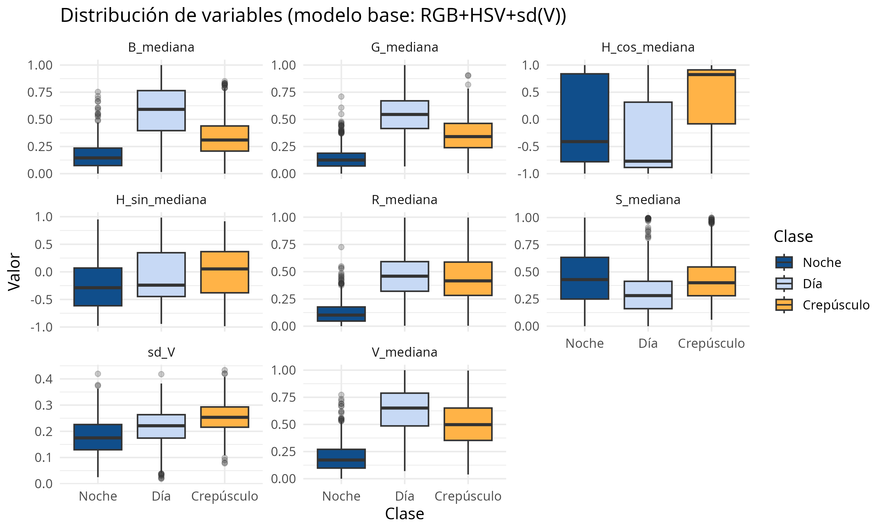
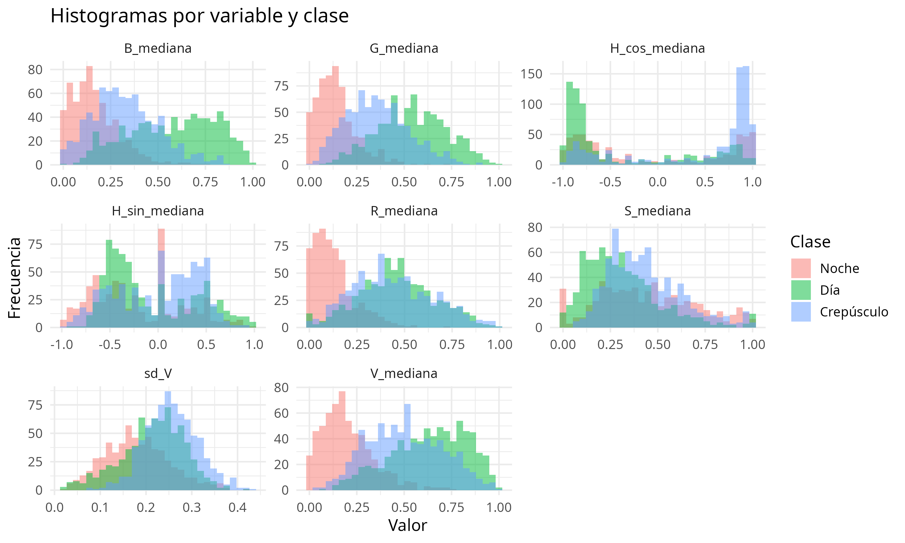
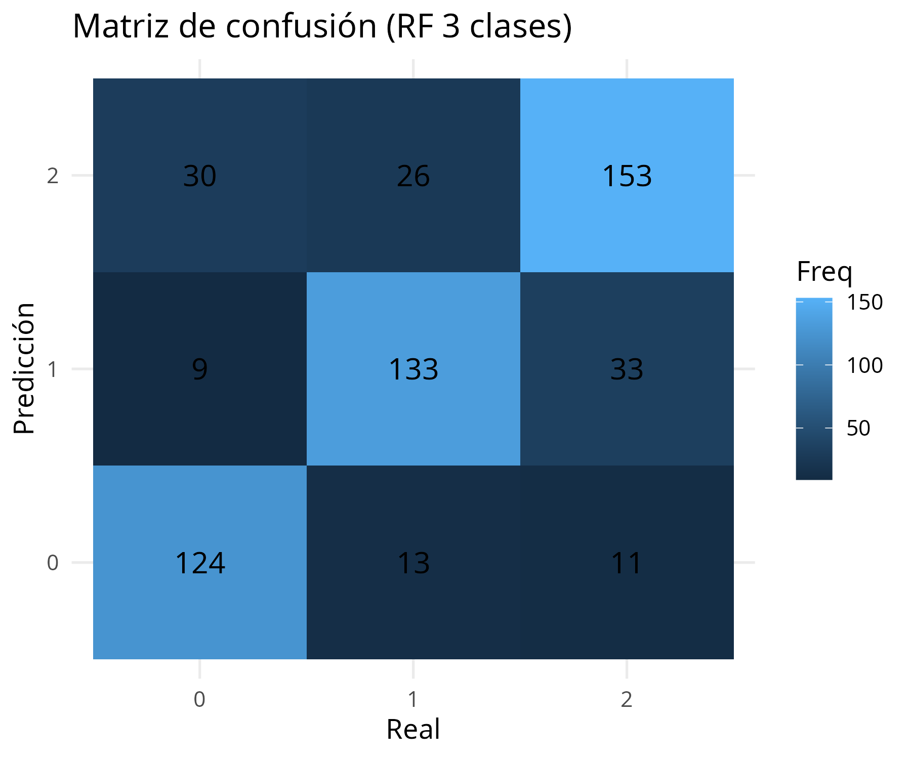
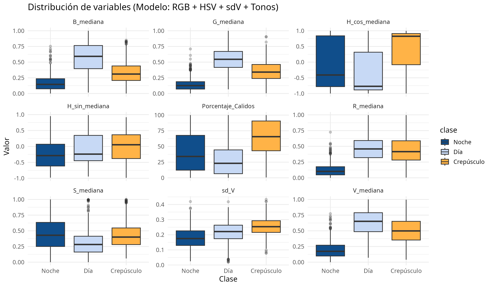
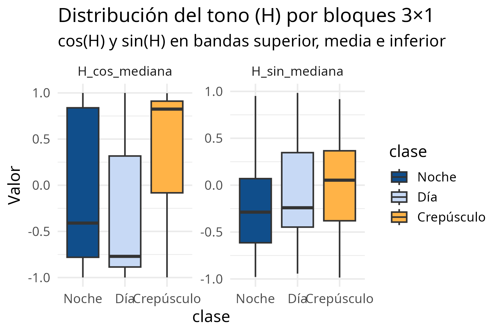
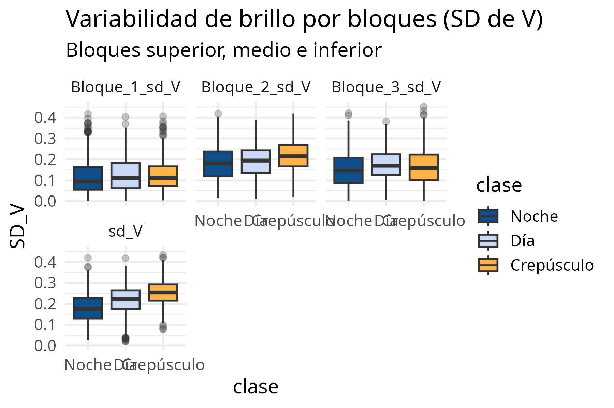
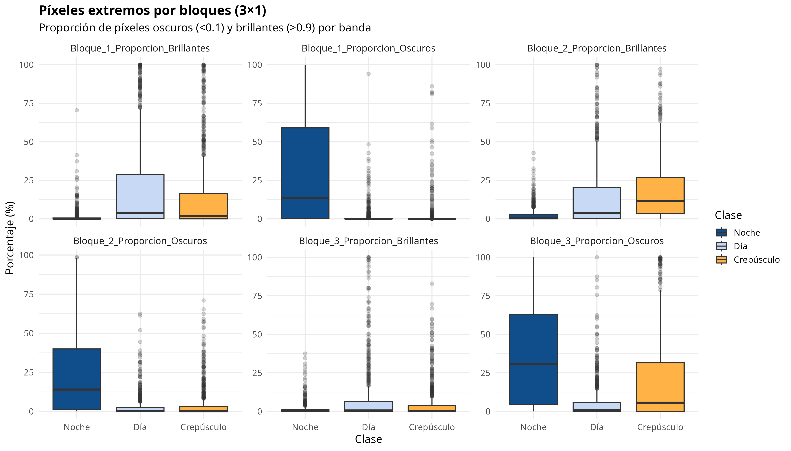
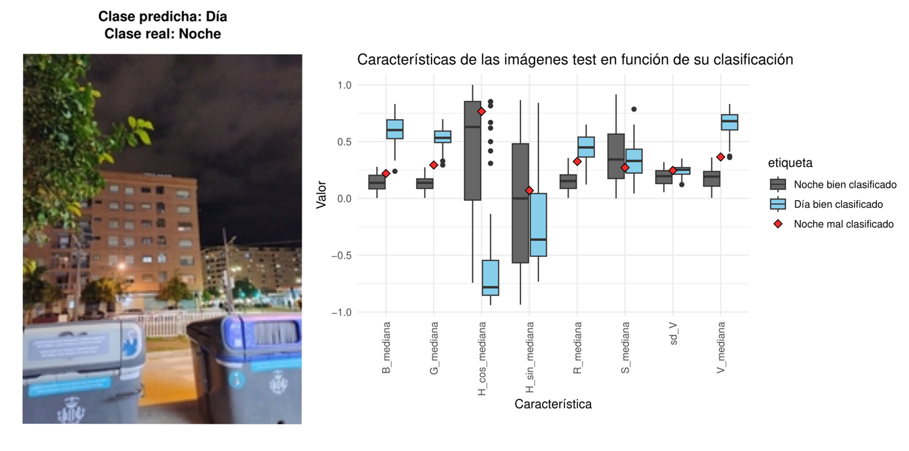
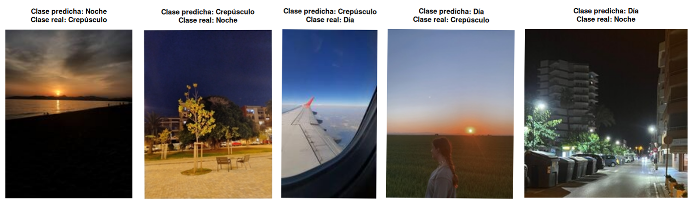

```{r setup, include=FALSE}
knitr::opts_chunk$set(echo = TRUE)
```


## Clasificación Multiclase: Añadiendo "Crepúsculo"
Una vez validado el enfoque para la clasificación binaria día/noche, se amplía el problema a una clasificación multiclase incorporando una tercera categoría: crepúsculo. Esta clase representa un estado intermedio entre el día y la noche, caracterizado por una iluminación reducida, la presencia de tonos cálidos y una fuerte estructura vertical de brillo en la imagen.

Desde el punto de vista visual, el crepúsculo combina elementos propios de ambas clases: zonas aún iluminadas del cielo junto con regiones oscuras o con iluminación artificial. En particular, en nuestro conjunto de datos es habitual observar un suelo ya oscuro mientras que el cielo sigue recibiendo la luz residual del sol bajo en el horizonte, lo que genera un gradiente vertical muy marcado de luminosidad. Esto convierte a esta clase en un caso especialmente complejo y exige la incorporación de características que capturen simultáneamente el color y la estructura espacial de la imagen.  


En esta sección abordamos el problema de la clasificación automática de imágenes del cielo en tres categorías: Día, Noche y Crepúsculo. A diferencia del caso binario día/noche, la inclusión de la clase crepúsculo introduce un escenario intermedio con características visuales más ambiguas, lo que requiere un análisis más detallado tanto del color como de la distribución espacial de la luminosidad en la imagen.

Para resolver este problema se ha seguido un enfoque de aprendizaje supervisado basado en la extracción de características visuales y el entrenamiento de un clasificador Random Forest. Las imágenes empleadas proceden de un repositorio público y presentan una gran variabilidad en términos de condiciones meteorológicas, iluminación y composición visual.

El procedimiento seguido consiste en incorporar progresivamente diferentes grupos de características al modelo, evaluando en cada etapa si estas aportan una mejora en la capacidad de discriminación entre las clases. Este enfoque incremental permite identificar qué tipos de información (color, brillo, estructura espacial, etc.) son más relevantes para el problema planteado.

Se ha elegido el algoritmo Random Forest por su capacidad para manejar relaciones no lineales entre variables, su robustez frente a ruido y outliers, y su habilidad para combinar múltiples características heterogéneas sin necesidad de normalización previa. Una vez introducida la clase crepúsculo, se construyó un modelo base utilizando un conjunto reducido pero físicamente interpretables de características: las medianas de los canales RGB, las componentes HSV, el brillo (V) y la desviación estándar del canal V.
Estas variables capturan la intensidad de la luz, la tonalidad del cielo y la variabilidad del brillo en la escena. En particular, el canal V y su desviación estándar son clave para distinguir el crepúsculo, ya que este presenta simultáneamente zonas muy iluminadas (cielo) y zonas oscuras (suelo), mientras que el tono (H) permite detectar la presencia de colores cálidos típicos del amanecer y atardecer.  

El modelo base (RGB + HSV + sd(V)) obtiene un 76.7% de accuracy, mostrando una buena separación entre día y noche, pero mayores confusiones con el crepúsculo. Las variables más importantes son G_mediana y V_mediana, lo que confirma que la luminosidad y el color del cielo son claves para distinguir los distintos momentos del día.  

{width=70%}


La figura muestra que las variables RGB y V separan claramente día y noche, mientras que el crepúsculo aparece en valores intermedios. El brillo (V_mediana) y su variabilidad (sd_V) son especialmente discriminantes, y las componentes de H reflejan los tonos cálidos característicos del crepúsculo. Esto justifica el uso de RGB + HSV + sd(V) como modelo base.  

{width=60%}  


{width=40%}

La matriz de confusión muestra que las clases Noche y Día son clasificadas con alta precisión, mientras que la mayoría de los errores se concentran en la clase Crepúsculo. Esto es coherente con su naturaleza visual intermedia, ya que combina regiones iluminadas del cielo con zonas oscuras del suelo. Por tanto, este resultado justifica la necesidad de incorporar características espaciales, como gradientes verticales y descomposición por bloques, para capturar la estructura de iluminación en la imagen.


### Nuevas Características para detectar Crepúsculo
Para poder distinguir correctamente la clase crepúsculo se han incorporado nuevas características diseñadas específicamente para capturar los patrones visuales propios de este momento del día.

En esta parte se ha añadido la proporción de tonos cálidos en la imagen. Durante el crepúsculo suelen aparecer colores rojizos, anaranjados y rosados, especialmente cerca del horizonte, como resultado de la baja altura del sol y de la dispersión de la luz en la atmósfera. Estos tonos no están presentes de forma significativa ni en imágenes diurnas ni en escenas nocturnas, por lo que esta característica resulta especialmente útil para identificar la clase crepúsculo.

En segundo lugar, se introduce el gradiente vertical del canal de luminosidad (V) dividido en bandas horizontales. Esta característica permite modelar el patrón típico de atardecer, donde la parte inferior de la imagen suele ser más luminosa o cálida (debido al sol bajo o luces artificiales), mientras que la parte superior es más oscura.

Finalmente, se incorporan características espaciales mediante una división de la imagen en tres bandas horizontales (superior, media e inferior). Para cada bloque se extraen estadísticas del matiz (H) y de la luminosidad (V), lo que permite capturar cómo varía el color y el brillo a lo largo de la vertical de la imagen. Este enfoque es especialmente útil para diferenciar cielos despejados de día, escenas nocturnas y transiciones de crepúsculo.  

El modelo RGB+HSV+sd(V)+tonos cálidos alcanza una precisión del 76.9% en la clasificación multiclase (día, noche y crepúsculo), con un rendimiento equilibrado en las tres clases. Las variables más influyentes son los canales RGB, la luminosidad (V y sd(V)) y la proporción de tonos cálidos, lo que confirma que el color y la estructura de brillo son claves para distinguir el crepúsculo.


{width=70%}

Los boxplots muestran que el crepúsculo se caracteriza por un valor intermedio de brillo (V), una mayor variabilidad de la luminosidad (sd(V)) y una proporción significativamente más alta de tonos cálidos. Estas diferencias, junto con los canales RGB y HSV, explican por qué el modelo RGB+HSV+sd(V)+tonos cálidos es capaz de separar de forma efectiva las tres clases.


Característica Banda (Gradiente vertical de V)
Para mejorar la detección del crepúsculo, se incorpora el gradiente vertical del canal de luminosidad V calculado por bandas horizontales. Esta característica permite capturar la estructura típica del atardecer, donde la parte inferior de la imagen suele ser más luminosa (horizonte, sol bajo o luces) y la parte superior más oscura (cielo). De este modo, se añade información espacial que complementa las estadísticas globales de color y brillo.  

La inclusión del gradiente vertical del canal V por bandas horizontales mejora la clasificación hasta un 80.6%, ya que permite capturar la estructura típica del crepúsculo, donde el brillo varía fuertemente entre la parte inferior y superior de la imagen.

{width=70%}  

El gradiente vertical del canal V por bandas captura cómo cambia el brillo entre la parte superior e inferior de la imagen.
En las imágenes diurnas este gradiente es mayor debido al contraste entre cielo brillante y suelo oscuro, mientras que en el crepúsculo la transición es más suave.
Esto permite diferenciar mejor las tres clases y explica la mejora del modelo al incorporar esta característica.  

Además de los gradientes por bandas, se ha probado un enfoque alternativo basado en dividir la imagen en tres bloques horizontales (superior, medio e inferior), con el objetivo de capturar de forma más explícita la estructura espacial típica del crepúsculo.
Esta división se motiva por la estructura visual típica del crepúsculo: el cielo suele ocupar la parte superior de la imagen, con tonos más fríos u oscuros; la zona del horizonte presenta colores cálidos debido al sol bajo; y la parte inferior corresponde al suelo o a zonas más oscuras. Al analizar estas regiones por separado, el modelo puede capturar mejor cómo varían el color (H) y la luminosidad (V) a lo largo de la vertical de la imagen, lo que resulta especialmente útil para distinguir entre día, noche y crepúsculo.

Para capturar la estructura espacial característica del crepúsculo, se ha dividido la imagen en tres bandas horizontales (superior, central e inferior). En cada bloque se extraen estadísticas del matiz (H) y de la luminosidad (V), lo que permite modelar explícitamente cómo varían el color y el brillo a lo largo de la vertical de la imagen.

Este enfoque es especialmente adecuado para el crepúsculo, ya que los tonos cálidos suelen concentrarse cerca del horizonte (bloque central), mientras que el cielo superior y la parte inferior presentan comportamientos distintos.  

{width=70%} 

En esta figura se muestra la distribución del tono (H), representado mediante sus componentes cos(H) y sin(H), calculados de forma separada en tres bandas horizontales de la imagen: superior, media e inferior.

Esta representación permite analizar cómo varía el color dominante a lo largo de la vertical de la imagen, lo que resulta especialmente relevante en escenas de crepúsculo, donde el cielo cercano al horizonte suele presentar tonos cálidos mientras que la parte superior permanece más azul u oscura.

Se observa que la clase Crepúsculo presenta una separación más marcada respecto a Día y Noche, especialmente en los bloques inferior y medio, lo que confirma que la estructura vertical del tono es una característica discriminativa para este tipo de escenas.  

{width=70%}

Esta figura muestra la desviación estándar del canal de luminosidad (V) calculada en tres bandas horizontales de la imagen (superior, media e inferior). Esta medida cuantifica cuánta variación de brillo existe dentro de cada zona.

Se observa que la clase Crepúsculo presenta sistemáticamente una mayor variabilidad de brillo, especialmente en los bloques medio e inferior, lo que refleja la coexistencia de zonas muy iluminadas (horizonte, luces artificiales) y regiones oscuras (cielo o suelo). En contraste, las imágenes de Día muestran una iluminación más homogénea, mientras que en Noche el brillo es bajo y más uniforme salvo por focos puntuales.

Estos patrones confirman que la estructura vertical de la variabilidad del brillo es una característica relevante para distinguir escenas de crepúsculo.  

Además de las medianas de color y de la variabilidad del brillo, se incorporan en este modelo características basadas en la proporción de píxeles extremos (muy oscuros y muy brillantes) dentro de cada una de las tres bandas horizontales de la imagen (superior, media e inferior).

Para cada bloque se calcula el porcentaje de píxeles con valores muy bajos de luminosidad (V < 0.1) y muy altos (V > 0.9), lo que permite cuantificar la presencia simultánea de zonas oscuras y focos intensamente iluminados.

Esta información es especialmente relevante para la clase crepúsculo, donde suelen coexistir regiones oscuras del cielo con áreas muy brillantes cerca del horizonte o procedentes de iluminación artificial. En contraste, las imágenes de día presentan una iluminación más homogénea, mientras que en la noche predominan zonas oscuras con pocos puntos de alta intensidad.

De este modo, estas características por bloques permiten capturar no solo la estructura vertical del brillo, sino también la coexistencia de extremos de luminosidad, mejorando la capacidad del modelo para distinguir escenas de transición como el crepúsculo.    
{width=70%}  

La distribución de píxeles extremadamente oscuros y brillantes por bloques 3×1 revela un patrón vertical característico del crepúsculo: mayor luminosidad en la banda central (horizonte), valores intermedios en la superior y presencia moderada de luces en la inferior. Este patrón lo diferencia tanto del día como de la noche y explica la mejora del modelo al incorporar estas variables.


### Análisis de Componentes Principales (PCA)
Dado el elevado número de características extraídas, muchas de ellas altamente correlacionadas (por ejemplo, variables de color y de brillo en diferentes zonas de la imagen), se aplica un Análisis de Componentes Principales (PCA) como técnica de reducción de dimensionalidad.

El PCA permite proyectar el espacio original de características en un conjunto reducido de componentes no correlacionados que concentran la mayor parte de la variabilidad de los datos. En este trabajo se seleccionan los primeros componentes que explican aproximadamente el 95% de la varianza total, lo que permite reducir el ruido y mejorar la estabilidad del modelo sin perder información relevante.

Estas componentes principales se utilizan posteriormente como entrada para el clasificador, permitiendo comparar el rendimiento del modelo original con el modelo basado en PCA.  

El modelo original cuenta con 24 características, y una precisión del 82.71%, tras aplicar una PCA a las características y reducir el problema a uno con 14 variables obtenemos un modelo con una precisión del 79.89%. Encontramos por tanto una diferencia poco notable en la precisión tras aplicar una PCA a nuestras características, por lo que es pertinente utilizar esta técnica en el modelo final.

## Modelo Final Temporal
El modelo final se construye utilizando un Random Forest entrenado sobre el conjunto completo de características seleccionadas: RGB, HSV, desviación estándar de V, proporción de tonos cálidos, gradientes verticales y características por bloques 3×1, a las que se ha aplicado previamente una PCA que reduce el número de características a 14.

Este conjunto de variables permite capturar simultáneamente información de color, luminosidad global y estructura espacial, lo que resulta fundamental para distinguir entre las tres clases temporales: Día, Noche y Crepúsculo.

El rendimiento del modelo se evalúa mediante una matriz de confusión y métricas globales como la precisión (accuracy), mostrando una alta capacidad de discriminación incluso en la clase crepúsculo, que es la más ambigua. Además, el análisis de importancia de variables del Random Forest permite identificar qué características contribuyen más a la clasificación, destacando especialmente las relacionadas con el brillo (V), los tonos cálidos y las estructuras verticales.


# Evaluación con Conjunto de Test 
Tras haber desarrollado los modelos Random Forest pertinentes para la clasificación temporal y meteorológica de imágenes, procederemos a evaluar su desempeño en un conjunto de test, constituido por imágenes tomadas por los integrantes del grupo y preprocesadas como se indicó en el apartado 2.  
Para ello crearemos un modelo definitivo Random Forest para cada problema de clasificación estudiado que utilice las características óptimas escogidas para cada caso y se entrene usando todo el conjunto de test disponible, es decir, se incorporará al entrenamiento de los modelos desarrollados el conjunto de datos utilizado previamente para validación.

## Resultados en Clasificación Temporal
Para la clasificación temporal contamos con dos modelos diferentes desarrollados, un Random Forest más sencillo y con un menor número de características para la clasificación binaria de imágenes en día/noche y otro más complejo para la clasificiación de imágenes en día/noche/crepúsculo.  


### Resultados en Clasificación Temporal Binaria
Evaluaremos el modelo seleccionado en el apartado 4.1.2 en un total de 80 imágenes de test, de las cuales 40 pertenecen a la clase Día y 40 pertenecen a la clase Noche. Realizando las predicciones y comparando con las etiquetas reales obtenemos las siguientes métricas de evaluación:  

| Exactitud | Sensibilidad | Especifidad | Precisión |   F1  |
|:---------:|:------------:|:-----------:|:---------:|:-----:|
|   0.988   |     0.975    |      1      |     1     | 0.987 |
Table: Estadísticos de la matriz de confusión para el test de nuestro clasificador temporal binario.

Encontramos que el modelo seleccionado para la clasificación binaria es robusto y clasifica bien nuestras imágenes de test ya que posee una exactitud balanceada de 0.988. A partir de los resultados obtenidos averiguamos que solamente se ha clasificado incorrectamente una imagen. Para analizar más detalladamente este error representaremos esta imagen y sus características en relación al resto de imágenes de test en la siguiente figura:  

{width=70%}

Podemos comprobar que la mayoría de las características de la imagen mal clasificada se encuentran en un rango intermedio entre las características de las imágenes bien clasificadas de día y noche, teniendo valores de `V_mediana`, `R_mediana` y `G_mediana` altos para ser una imagen de noche. Esto es debido a que, aunque sea una imagen nocturna, está muy iluminada y presenta colores vivos, hecho que puede confundir al clasificador.

### Resultados en Clasificación Temporal Multiclase
Evaluaremos el modelo seleccionado en el apartado 4.3 en un total de 120 imágenes de test, equitativamente distribuidas en las clases Día, Noche y Crepúsculo. Realizando las predicciones y comparando con las etiquetas reales obtenemos las siguientes métricas de evaluación:  

|    Clase   | Exactitud | Sensibilidad | Especifidad | Precisión |   F1  |
|:----------:|:---------:|:------------:|:-----------:|:---------:|:-----:|
|    Noche   |   0.894   |     0.800    |    0.988    |   0.970   | 0.877 |
|     Día    |   0.918   |     0.950    |    0.888    |   0.801   | 0.874 |
| Crepúsculo |   0.850   |     0.800    |    0.900    |   0.800   | 0.800 |

Table: Estadísticos de la matriz de confusión para el test de nuestro clasificador temporal multiclase.

Obtenemos también la exactitud conjunta (todas las predicciones correctas respecto del total) para las tres clases que será de **0.850**. Encontramos que se ha reducido la exactitud respecto del caso de clasificación binaria, lo cual es esperable ya que este es un problema más complejo. No obstante las características adicionales para este clasificador han permitido mantener un buen desempeño en nuestras imágenes de test.  
A partir de nuestros resultados podemos comprobar que la nueva clase, Crepúsculo, es la que ha dado lugar a mayor confusión en el modelo: del las 18 imágenes mal clasificadas 16 de los errores vienen dados por imágenes de la categoría Crepúsculo siendo clasificadas como Día/Noche o imágenes de las categorías Día/Noche siendo clasificadas como Crepúsculo. Se aprecia una clara tendencia a predecir la clase Día imágenes de tipo Crepúsculo y a predecir la clase Crepúsculo para imágenes de tipo Noche. La tendencia a confundir la categoría Crepúculo queda también reflejada en sus correspondientes estadísticos para la matriz de confusión, que presenta una clara disminución en la exactitud y el estadístico F1 respecto del resto de categorías.  
Dado que temporalmente el crepúsculo es el momento que se encuentra entre el día y la noche es razonable que estas imágenes presenten una mayor similitud a Día o Noche, dando lugar a un mayor error de clasificación para esta clase.   
En este caso una representación de las características de mas imágenes clasificadas erróneamente respecto a las bien clasificadas similar a la realizada en la Figura Y no permite realizar observaciones tan claras que expliquen esta mala clasificación (posiblemente debido a la mayor complejidad del modelo) por lo que nos limitaremos a una inspección visual de las imágenes erroneamente clasificadas de cada tipo, de las cuales mostramos ejemplos representativos en la Figura X: 
\newpage  

{width=80%}  


Como se ejemplifica en la Figura X, encontramos que las imágenes de Noche mal clasificadas como Crepúsculo presentan buena iluminación (para tratarse de una imagen nocturna) y tonos rojizos, similarmente las imágenes de Noche mal clasificadas como Día presentan también buena iluminación pero cn fuentes principalmente de luz blanca. En cuanto a Crepúsculo la mayoría de las imágenes mal clasificadas como Día presentan una importante proporción de tonos azules en el cielo, mientras que la única image predicha como Noche presenta tonos muy oscuros en gran parte de la imagen. Finalmente, para la categoría Día no se encuentra ninguna imagen erróneamente etiquetada como Noche, pero sí algunas para las que se ha predicho la categoría Crepúsculo, en nuestro conjunto de test las dos imágenes para las que se ha encontrado este error presentan una parte sombreada en la parte inferior, que quizá puede resultar similar al paisaje característico de una imagen durante el crepúsculo.  


## Resultados en Clasificación Meteorológica

## Conclusiones y Líneas Futuras  

```{r, echo=FALSE, message=FALSE}
library(dplyr)
library(kableExtra)

modelo <- c("Temporal binario", "Temporal multiclase", "Meteorológico")

# VARIABLES DE CADA MODELO
variables_dia_noche <- "Mediana de los canales R, G, B, H_cos, H_sin, S y V; y desviación estándar de V"
variables_dia_noche_crepusculo <- "Mediana de los canales R, G, B, H_cos, H_sin, S y V; desviación estándar de V, proporción de tonos cálidos, gradientes verticales y características por bloques 3×1 + PCA (14 componentes)"
variables_despejado_nublado <- "Mediana de los canales R, G, B, H_sin, H_cos, S y V; ratio de azul en la imagen, brillo, contraste, media del gradiente Sobel + PCA (6 componentes)"
variables <- c(variables_dia_noche, variables_dia_noche_crepusculo,variables_despejado_nublado)

# ACCURACY DE VALIDATION DE CADA MODELO
val_dia_noche <- "90.15 %"
val_dia_noche_crepusculo <- "79.89 %"
val_despejado_nublado <- "XX.XX %"
accuracy_validacion <- c(val_dia_noche, val_dia_noche_crepusculo, val_despejado_nublado)

# ACCURACY DE TEST DE CADA MODELO
test_dia_noche <- "98.75 %"
test_dia_noche_crepusculo <- "85.00 %"
test_despejado_nublado <- "XX.XX %"
accuracy_test <- c(test_dia_noche, test_dia_noche_crepusculo, test_despejado_nublado)

datos_tabla <- data.frame(modelo, variables, accuracy_validacion, accuracy_test)

knitr::kable(
  datos_tabla,
  format = "latex",
  booktabs = TRUE,
  col.names = c("Clasificador", "Variables", "Exactitud validacion", "Exactitud test"),
  caption = "Características utilizadas y exactitud para cada uno de los modelos finales"
) %>%
  kableExtra::column_spec(2, width = "6.5cm") %>%
  kable_styling(latex_options = "HOLD_position")
```
